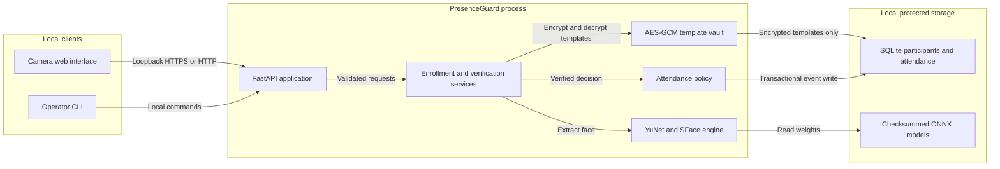

# Architecture

PresenceGuard is intentionally a local modular monolith. Face frames do not cross a network boundary beyond the loopback HTTP request, and no cloud biometric service is required.

## Component Responsibilities

| Component | Owns | Explicitly does not own |
| --- | --- | --- |
| Camera interface | Ephemeral capture, consent UI, check-in feedback | Face matching, storage, threshold decisions |
| FastAPI application | Media limits, response schemas, admin boundary, request IDs | Biometric algorithm logic |
| Face engine | Decode, single-face policy, alignment, quality gates, normalized 128D embedding | Participant lookup or attendance writes |
| Enrollment service | Consent, sample-count policy, rejected-frame accounting, template creation | Raw frame persistence |
| Verification service | Template lookup/decryption, maximum-reference similarity, threshold decision | Authentication or liveness claims |
| Template cipher | AES-256-GCM, random nonce, participant-bound associated data | Key storage or rotation orchestration |
| Attendance repository | UTC events, idempotency, duplicate window, cascade deletion | Identity proof beyond the verification result |
| Model downloader | Fixed HTTPS sources and SHA-256 verification | Automatic trust in changed upstream files |

## Verification Flow

1. The client captures one frame and sends it with a unique idempotency key.
2. The API checks media type and byte limits without writing the upload to disk.
3. YuNet must find exactly one sufficiently large face; lighting and sharpness gates must pass.
4. SFace aligns the detected face and emits a normalized 128-dimensional embedding.
5. The template vault decrypts that participant's reference matrix in memory.
6. The service takes the maximum cosine similarity across references and applies the participant's stored threshold.
7. A below-threshold decision returns without an attendance write.
8. A match enters an immediate SQLite transaction. An existing idempotency key returns the original record; a recent event returns `duplicate`; otherwise one attendance row is committed.

## Data Model

`participants` stores a pseudonymous participant ID, local display name, encrypted template blob, sample count, calibrated threshold, and consent/creation timestamps. `attendance_events` stores an event UUID, participant foreign key, UTC time, similarity, and unique request ID. Deleting a participant cascades to their attendance events.

Raw images are absent from the schema by design.

## Trust Boundaries

- The default bind address is `127.0.0.1`.
- Enrollment, deletion, and attendance listing require `X-Admin-Token`.
- Verification requires `Idempotency-Key`, which also forces cross-origin browsers to preflight.
- The encryption key and admin token are environment configuration and must not enter Git or logs.
- Route-template logging omits participant IDs, query strings, request bodies, embeddings, images, and client IPs.
- A real deployment still needs institutional authentication, TLS termination, key management, authorization roles, retention enforcement, and validated liveness or a second factor.
